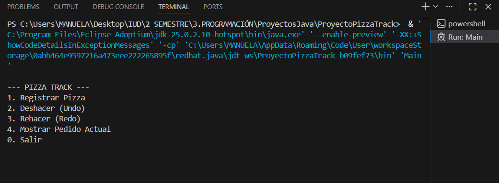
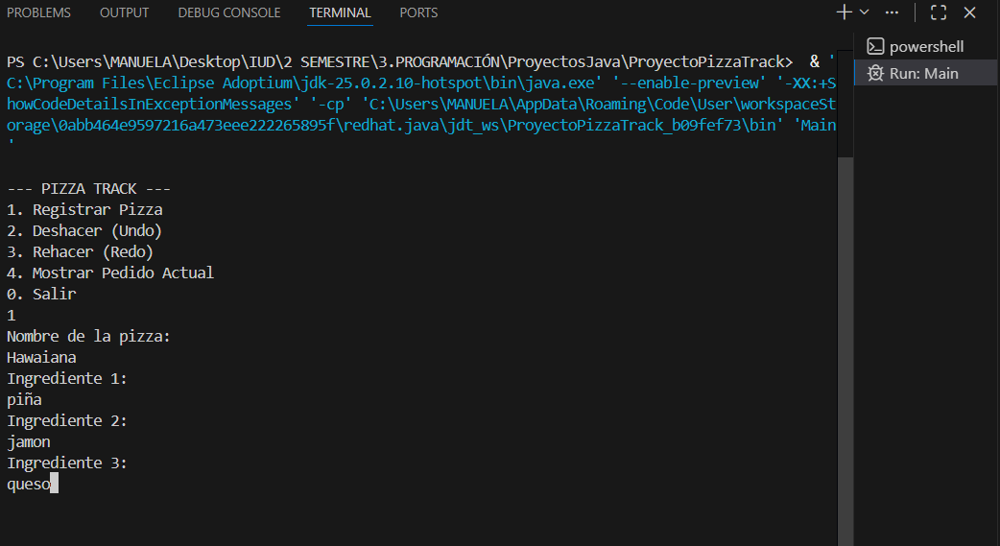
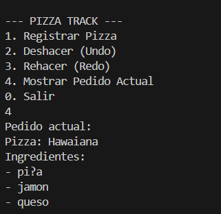
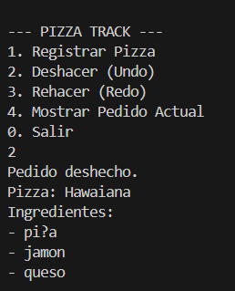
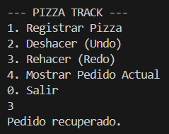

# Proyecto PizzaTrack

Sistema de gestión de pedidos de una pizzería desarrollado en Java.

## Objetivo
Desarrollar una aplicación en Java que simule el sistema de gestión de pedidos de una pizzería.
El sistema utiliza pilas manuales implementadas con listas ligadas para permitir registrar pedidos,
deshacer acciones (Undo) y rehacer acciones (Redo).

## Funcionalidades
- Registrar pizza
- Deshacer pedido (Undo)
- Rehacer pedido (Redo)
- Mostrar pedido actual

## Capturas ejecución del programa

## Autor
Manuela Arredondo

## Video de sustentación
Aquí se encuentra el video explicativo del funcionamiento del sistema: https://drive.google.com/file/d/1Dp-20PdYmQAnRUGUxawzHiLfjDtK-EgT/view?usp=sharing 